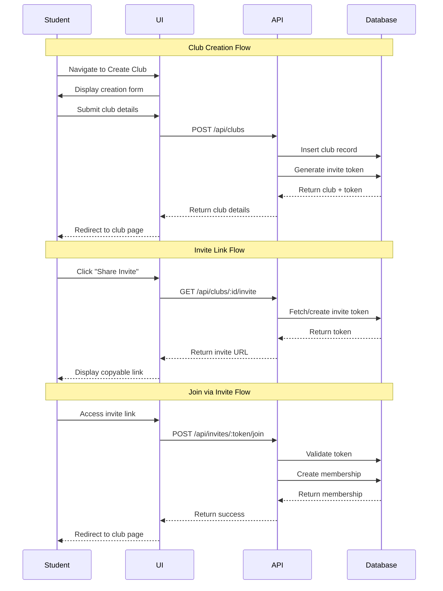

# Design Document

## Overview

This design implements a club creation workflow and invite link system for the EagleConnect platform. The solution enables authenticated students to create clubs through a form interface and share unique invite links that allow other students to join with a single click. The design follows the existing architecture patterns using Next.js, React Query, and Supabase.

## Architecture

### High-Level Flow



### Component Architecture

The implementation follows a layered architecture:

1. **Presentation Layer**: React components and pages
2. **Data Layer**: React Query hooks for state management
3. **API Layer**: Next.js API routes and client functions
4. **Database Layer**: Supabase PostgreSQL with new invite_tokens table

## Components and Interfaces

### Database Schema Changes

Add a new `invite_tokens` table to store club invite links:

```sql
CREATE TABLE IF NOT EXISTS public.invite_tokens (
  token_id UUID PRIMARY KEY DEFAULT gen_random_uuid(),
  club_id UUID NOT NULL REFERENCES public.clubs(club_id) ON DELETE CASCADE,
  token VARCHAR(64) UNIQUE NOT NULL,
  created_at TIMESTAMP WITH TIME ZONE DEFAULT NOW(),
  UNIQUE(club_id)
);

CREATE INDEX idx_invite_tokens_token ON public.invite_tokens(token);
CREATE INDEX idx_invite_tokens_club ON public.invite_tokens(club_id);
```

**Design Rationale**: 
- One invite token per club (enforced by UNIQUE constraint on club_id)
- Tokens are URL-safe random strings
- Cascade deletion ensures orphaned tokens are removed when clubs are deleted
- Indexed token field for fast lookup during join operations

### API Endpoints

#### 1. Create Club (Enhancement)
**Endpoint**: `POST /api/clubs`

**Request Body**:
```typescript
{
  name: string;
  description?: string;
  category: string;
  coverPhotoUrl?: string;
}
```

**Response**:
```typescript
{
  success: true;
  data: ClubDetails & { inviteToken: string }
}
```

**Logic**:
- Validate input data
- Create club record with authenticated student as admin
- Generate unique invite token
- Insert invite token record
- Return club details with token

#### 2. Get Club Invite
**Endpoint**: `GET /api/clubs/:clubId/invite`

**Authorization**: Must be club admin

**Response**:
```typescript
{
  success: true;
  data: {
    inviteUrl: string;
    token: string;
  }
}
```

**Logic**:
- Verify requester is club admin
- Fetch existing invite token or create if none exists
- Return full invite URL

#### 3. Join via Invite
**Endpoint**: `POST /api/invites/:token/join`

**Authorization**: Must be authenticated

**Response**:
```typescript
{
  success: true;
  data: {
    clubId: string;
    membership: MembershipDto;
  }
}
```

**Logic**:
- Validate token exists
- Fetch associated club
- Check if student is already a member
- Create membership with 'active' status
- Return membership details

### Frontend Components

#### 1. Create Club Page
**Path**: `/clubs/create`

**Component Structure**:
```typescript
CreateClubPage
├── Header
└── CreateClubForm
    ├── Input (name)
    ├── Textarea (description)
    ├── Select (category)
    ├── Input (coverPhotoUrl)
    └── Button (submit)
```

**State Management**:
- Form state using React Hook Form
- Mutation using `useCreateClub` hook
- Navigation using Next.js router

#### 2. Club Invite Section
**Location**: Club detail page (for admins only)

**Component Structure**:
```typescript
ClubInviteSection
├── Card
    ├── CardHeader ("Share Invite Link")
    └── CardContent
        ├── Input (readonly invite URL)
        └── Button (copy to clipboard)
```

**State Management**:
- Invite data using `useClubInvite` hook
- Clipboard API for copy functionality
- Toast notifications for feedback

#### 3. Invite Join Page
**Path**: `/invites/[token]`

**Component Structure**:
```typescript
InviteJoinPage
├── Header
└── InviteContent
    ├── ClubPreview (club info)
    ├── Button (join club)
    └── ErrorMessage (if invalid)
```

**State Management**:
- Token validation using `useJoinViaInvite` hook
- Authentication check with redirect
- Success redirect to club page

## Data Models

### TypeScript Types

```typescript
// New types for invite functionality
export interface InviteToken {
  tokenId: string;
  clubId: string;
  token: string;
  createdAt: string;
}

export interface InviteDetails {
  inviteUrl: string;
  token: string;
}

export interface JoinViaInviteResponse {
  clubId: string;
  membership: MembershipDto;
}

// API response types
export type GetInviteResponse = ApiResponse<InviteDetails>;
export type JoinViaInviteApiResponse = ApiResponse<JoinViaInviteResponse>;
```

### Token Generation

Tokens will be generated using a cryptographically secure random string:

```typescript
function generateInviteToken(): string {
  const bytes = crypto.getRandomValues(new Uint8Array(32));
  return Array.from(bytes)
    .map(b => b.toString(16).padStart(2, '0'))
    .join('');
}
```

**Design Rationale**: 64-character hex string provides sufficient entropy to prevent guessing attacks while remaining URL-safe.

## Error Handling

### API Error Codes

| Code | HTTP Status | Description | User Message |
|------|-------------|-------------|--------------|
| `INVALID_TOKEN` | 404 | Invite token not found | "This invite link is invalid or has expired" |
| `ALREADY_MEMBER` | 409 | Student already in club | "You're already a member of this club" |
| `UNAUTHORIZED` | 401 | Not authenticated | "Please log in to join this club" |
| `FORBIDDEN` | 403 | Not club admin | "Only club admins can access invite links" |
| `VALIDATION_ERROR` | 400 | Invalid input data | Specific field errors |
| `CLUB_NOT_FOUND` | 404 | Club doesn't exist | "Club not found" |

### Frontend Error Handling

- Display toast notifications for all errors
- Redirect to login for authentication errors
- Show inline validation errors on forms
- Provide fallback UI for invalid invite links

## Testing Strategy

### Unit Tests

1. **Token Generation**
   - Verify token uniqueness
   - Validate token format (64 hex characters)
   - Test collision handling

2. **API Functions**
   - Test clubsApi.createClub with valid/invalid data
   - Test clubsApi.getInvite with admin/non-admin users
   - Test clubsApi.joinViaInvite with valid/invalid tokens

3. **React Hooks**
   - Test useCreateClub mutation success/error states
   - Test useClubInvite data fetching
   - Test useJoinViaInvite with various scenarios

### Integration Tests

1. **Club Creation Flow**
   - Create club → verify database record
   - Create club → verify invite token generated
   - Create club → verify redirect to club page

2. **Invite Link Flow**
   - Generate invite → verify URL format
   - Copy invite → verify clipboard content
   - Access invite as non-admin → verify forbidden

3. **Join via Invite Flow**
   - Valid token + authenticated → verify membership created
   - Valid token + unauthenticated → verify redirect to login
   - Invalid token → verify error message
   - Already member → verify appropriate message

### End-to-End Tests

1. Complete club creation and invite sharing workflow
2. Join club via invite link as new member
3. Attempt to join already-joined club
4. Access invalid invite link

## Security Considerations

1. **Token Security**
   - Use cryptographically secure random generation
   - Store tokens hashed in database (optional enhancement)
   - Validate token format before database lookup

2. **Authorization**
   - Verify club admin status for invite generation
   - Require authentication for joining via invite
   - Prevent duplicate memberships

3. **Input Validation**
   - Sanitize club name and description
   - Validate category against allowed values
   - Limit URL length for cover photos

4. **Rate Limiting**
   - Limit club creation per user per time period
   - Limit invite generation requests
   - Limit join attempts per token

## Performance Considerations

1. **Database Indexes**
   - Index on invite_tokens.token for fast lookups
   - Index on invite_tokens.club_id for admin queries

2. **Caching**
   - Cache invite URLs in React Query
   - Invalidate cache on club deletion

3. **Optimistic Updates**
   - Optimistically update UI on club creation
   - Optimistically show membership on join

## Future Enhancements

1. **Invite Analytics**
   - Track invite link usage
   - Show join statistics to admins

2. **Invite Expiration**
   - Optional expiration dates for invites
   - Regenerate expired tokens

3. **Invite Permissions**
   - Limit number of uses per invite
   - Role-based invites (member vs admin)

4. **Social Sharing**
   - Pre-formatted share messages
   - Direct integration with messaging platforms
